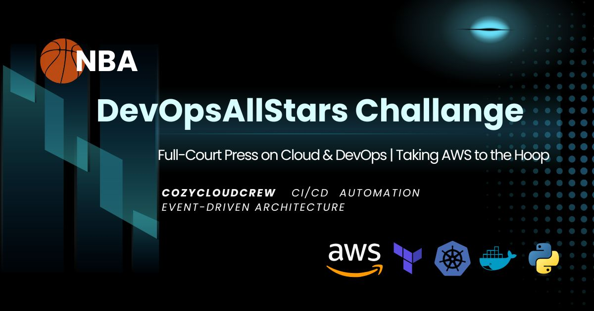

# AWS-NBA-DevOpsAllStars-Challenge

Welcome to my repository for the **AWS-NBA-DevOpsAllStars-Challenge**, hosted by **Cozy Cloud Crew!** This repository showcases a series of DevOps projects combining **NBA analytics and AWS-powered solutions** to solve real-world challenges. Each project is neatly organized into its own folder and highlights the use of modern cloud services, automation, and event-driven architecture.



## Projects Overview

| SN | Project Name                   | Cloud-Native DevOps Stack                                                                 | Project Description                                                                                                                                                                                                                 | Links |
|------------|--------------------------------|--------------------------------------------------------------------------------------------|-------------------------------------------------------------------------------------------------------------------------------------------------------------------------------------------------------------------------------------|-------|
| 1          | [Weather Dashboard](D1-Weather%20Dashboard/)              | AWS S3, OpenWeather API, Python                                               | A Python-based solution that fetches real-time weather data from the OpenWeather API and stores it in AWS S3 for analysis and visualization.                  | [Blog](https://blogs.vijaysingh.cloud/weather-dashboard) / [Portfolio](https://vijaysingh.cloud) |
| 2          | [NBA Game Day Notification Alert](D2-NBA%20Game%20Day%20Notification%20Alert/)| AWS Lambda, SNS, EventBridge, Sports API, Python                                   | An event-driven application that retrieves live NBA game updates using the Sports API and sends notifications via AWS SNS. The system utilizes AWS Lambda for processing, EventBridge for scheduling. | [Blog](https://blogs.vijaysingh.cloud) / [Portfolio](https://vijaysingh.cloud) |
<!-- | 3          | NBA Data Lake                  | AWS S3, Glue, Athena, Python, Terraform                                                    | A sports analytics data lake leveraging AWS S3 for storage, AWS Glue for data cataloging, and AWS Athena for querying. Python scripts are used for data ingestion, and Terraform manages the infrastructure.                        | [Blog](https://blogs.vijaysingh.cloud) / [Portfolio](https://vijaysingh.cloud) | -->

## Learning Highlights
> Note: Click on the project names below to view their respective architecture diagrams.
### [Weather Dashboard](Assests/D1-Weather%20Dashboard/1.architechture.png)
- **API Integration**: Gained experience in fetching and processing data from the OpenWeather using Python API.
- **AWS S3**: Learned to store and manage data in AWS S3 buckets through python script.

### [NBA Game Day Notification Alert](Assests/D2-GameDayNotification/architecture.png)
- **Event-Driven Architecture**: Designed workflows using AWS EventBridge to trigger AWS Lambda functions.
- **Notification Services**: Implemented AWS SNS to send real-time notifications via email/SMS.
<!-- - **Containerization (Docker)**: Utilized Docker to containerize applications, enhancing portability and consistency across environments. -->

<!-- ### NBA Data Lake
- **Data Storage**: Organized raw and processed data in AWS S3 buckets.
- **Data Cataloging**: Employed AWS Glue to catalog datasets and define schemas.
- **Query Execution**: Executed SQL queries on stored data using AWS Athena.
- **Infrastructure as Code (Terraform)**: Managed infrastructure provisioning and configuration using Terraform. -->

## Repository Structure

```
AWS-NBA-DevOpsAllStars-Challenge-2025/
|
├── Assets/         # Contains screenshots for each project.
│   ├── D1-Weather-Dashboard/
│   ├── D2-NBA-Game-Day-Notification-Alert/
│   |   |
|   |   |
│   └── Dn-Final project
├── D1-Weather-Dashboard/
│   ├── src/
│   ├── weather_data/
|   ├── requirement.txt
│   └── README.md
├── D2-NBA-Game-Day-Notification-Alert/
│   ├── Policies/
│   ├── src/
│   └── README.md
|
├── D3-NBA-Data-Lake/
|
|
|
|
└── README.md (This file)
```

## Tools and Technologies Used

- **AWS Services**: S3, Lambda, EventBridge, SNS, Athena, Glue,
- **Programming Language**: Python
- **Infrastructure as Code**: Terraform
- **Containerization**: Docker
- **Other Tools**: Boto3, AWS CLI

## How to Use

1. **Clone this repository**:
   ```bash
   git clone https://github.com/vsingh55/AWS-NBA-DevOpsAllStars-Challenge-2025.git
   ```
2. **Navigate to the respective project folder** to explore its implementation and run the code.
3. **Follow the `README.md`** in each project folder for setup and execution instructions.


## Author
Vijay Kumar Singh  
LinkedIn: [Happy to Connect !!](https://www.linkedin.com/in/vsingh55)  
Portfolio: [Visit my website](https://vijaysingh.cloud)   
Blog: [Feel free to checkout](https://blogs.vijaysingh.cloud)

---

Check back frequently as this repository evolves throughout the challenge. Happy exploring! 🚀
